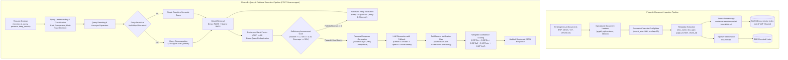

# Financial Research Assistant — System Architecture

```mermaid
flowchart TD
    subgraph Phase_A ["Phase A: Document Ingestion Pipeline"]
        A1["Heterogeneous Documents\n(PDF, DOCX, TXT, CSV/XLSX)"] --> A2["Specialized Document Loaders\n(pypdf, python-docx, tabular)"]
        A2 --> A3["RecursiveCharacterTextSplitter\n(chunk_size=500, overlap=50)"]
        A3 --> A4["Metadata Extraction\n(doc_name, doc_type, page_number, chunk_id)"]
        A4 --> A5["Dense Embeddings\nsentence-transformers/all-MiniLM-L6-v2"]
        A4 --> A6["Sparse Tokenization\nBM25Okapi"]
        A5 --> A7[("FAISS Dense Vector Index\nIndexFlatIP (Cosine)")]
        A6 --> A8[("BM25 Inverted Index")]
    end

    subgraph Phase_B ["Phase B: Query & Retrieval Execution Pipeline (POST /finance-agent)"]
        B1["Request Contract\n(session_id, query, persona, deep_search)"] --> B2["Query Understanding & Classification\n(Fact, Comparison, Multi-Hop, Decision)"]
        B2 --> B3["Query Rewriting & Acronym Expansion"]
        B3 --> B4{"Deep Search or\nMulti-Hop / Decision?"}
        B4 -- Yes --> B5["Query Decomposition\n(2-3 Logical Sub-Queries)"]
        B4 -- No --> B6["Single Rewritten Semantic Query"]
        B5 --> B7["Hybrid Retrieval\nDense FAISS + Sparse BM25"]
        B6 --> B7
        B7 --> B8["Reciprocal Rank Fusion (RRF, k=60)\nCross-Query Deduplication"]
        B8 --> B9{"Sufficiency Assessment Gate\n(Volume >= 2, Sim >= 0.30, Coverage >= 50%)"}
        B9 -- Failed (Attempts < 3) --> B10["Automatic Retry Escalation\n(Retry 1: Expansion | Retry 2: Alternate)"]
        B10 --> B7
        B9 -- Passed / Max Retries --> B11["Persona Response Generation\n(Junior Analyst | PM | Compliance)"]
        B11 --> B12["LLM Generation with Fallback\n(Gemini 3.8 Flash -> OpenAI -> Rule-based)"]
        B12 --> B13["Faithfulness Verification Gate\n(Numerical Claim Extraction & Scrubbing)"]
        B13 --> B14["Weighted Confidence Scoring\n(0.30*Sim + 0.20*Div + 0.20*Suff + 0.15*Retry + 0.15*Verif)"]
        B14 --> B15["Audited Structured JSON Response"]
    end
```

